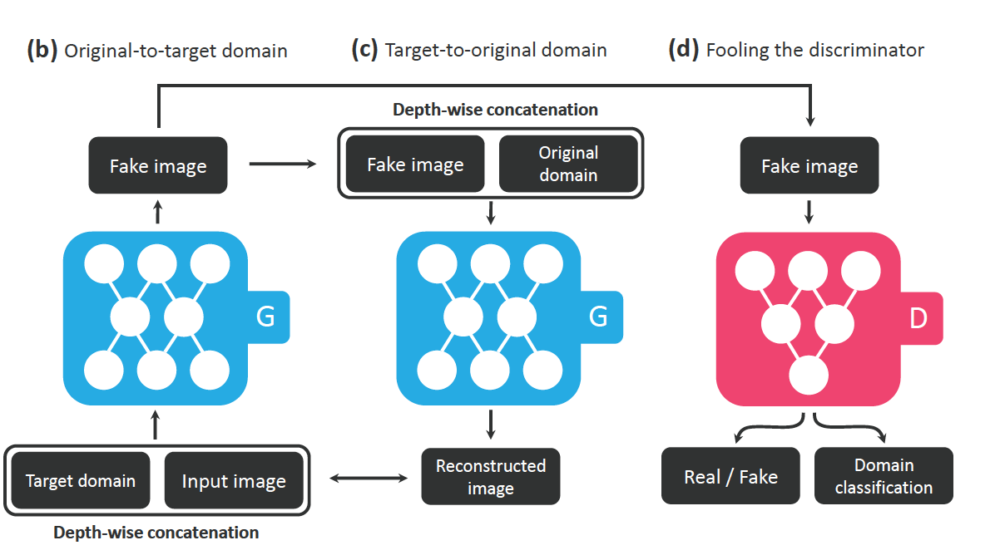

# GAN

## Table of Contents
  * [Unsupervised Representation Learning with Deep Convolutional Generative Adversarial Networks [ICLR 2016]](#DCGAN)
  * [InfoGAN: Interpretable Representation Learning by Information Maximizing Generative Adversarial Nets [NIPS 2016]](#InfoGAN)
  * [Conditional Generative Adversarial Nets](#CGAN)
  * [Unpaired Image-to-Image Translation using Cycle-Consistent Adversarial Networks (CycleGAN) [ICCV 2017]](#CycleGAN)
  * [Image-to-Image Translation with Conditional Adversarial Networks (Pix2Pix) [CVPR 2017]](#Pix2Pix)
  * [Progressive Growing of GANs for Improved Quality, Stability, and Variation (ProgressiveGAN) [ICLR 2018]](#ProgressiveGAN)
  * [Self-Attention Generative Adversarial Networks](#SAGAN)
  * [StarGAN: Unified Generative Adversarial Networks for Multi-Domain Image-to-Image Translation [CVPR 2018]](#StarGAN)
  * [Photo-Realistic Single Image Super-Resolution Using a Generative Adversarial Network](#SRGAN)
  * [A Style-Based Generator Architecture for Generative Adversarial Networks (StyleGAN) [CVPR 2019]](#styleGAN)
## DCGAN

`Unsupervised Representation Learning with Deep Convolutional Generative Adversarial Networks [ICLR 2016]`

[[link]](DCGAN.md)
## InfoGAN

`InfoGAN: Interpretable Representation Learning by Information Maximizing Generative Adversarial Nets [NIPS 2016]`

[[link]](InfoGAN.md)

## CGAN

`Conditional Generative Adversarial Nets`

[[link]](CGAN.md)
## CycleGAN

`Unpaired Image-to-Image Translation using Cycle-Consistent Adversarial Networks (CycleGAN) [ICCV 2017]`

[[link]](cyclegan.md)
## Pix2Pix

`Image-to-Image Translation with Conditional Adversarial Networks (Pix2Pix) [CVPR 2017]`

[[link]](pix2pix.md)

## ProgressiveGAN

`Progressive Growing of GANs for Improved Quality, Stability, and Variation (ProgressiveGAN) [ICLR 2018]`

[[link]](progressiveGAN.md)

## SAGAN

`Self-Attention Generative Adversarial Networks`

[[link]](sagan.md)

## StarGAN

`StarGAN: Unified Generative Adversarial Networks for Multi-Domain Image-to-Image Translation [CVPR 2018]`

[[link]](stargan.md)

## SRGAN

`Photo-Realistic Single Image Super-Resolution Using a Generative Adversarial Network`

[[link]](super-resolution.md)

## styleGAN

`A Style-Based Generator Architecture for Generative Adversarial Networks (StyleGAN) [CVPR 2019]`

[[link]](styleGAN.md)