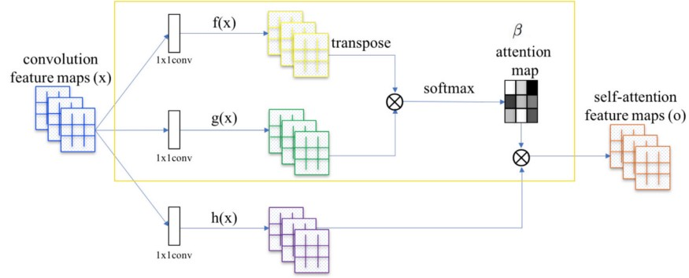
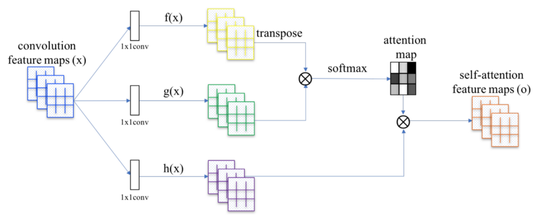

# Self-Attention Generative Adversarial Networks (SAGAN)

How can GAN use attention to improve image quality, like how attention improves accuracy in language translation and image captioning?


While convolutional filters are good at exploring spatial locality information, the receptive fields may not be large enough to cover larger structures. We can increase the filter size or the depth of the deep network but this will make GANs even harder to train. Alternatively, we can apply the attention concept. For example, to refine the image quality of the eye region (the red dot on the left figure), SAGAN only uses the feature map region on the highlight area in the middle figure. As shown below, this region has a larger receptive field and the context is more focus and more relevant. The proposed SAGAN generates images by leveraging complementary features in distant portions of the image rather than local regions of fixed shape to generate consistent objects/scenarios



- 픽셀 간 관계 -> attention map을 만든다. (1x1 convolution으로 transform 후)



- attention으로 feature map 새로 생성.

-  attention 기반으로 생성된 새로운 feature로 집중할 부분에만 더욱 집중할 수 있다. 해당 픽셀에 관련있는 부분만을 참고하여 (기존의 generator는 cnn 기반으로 주변의 픽셀만을 참고하여 만들었다.) 더 정확한 generation이 가능하다.

- 뿐만 아니라 attention 개념은 **discriminator에도 사용이 가능하다**. 더욱 의미있는 feature를 만드는 과정이므로, 더 정확한 분류 작업에도 사용할 수 있다. (Self-attention does not apply to the generator only. Both the generator and the discriminator use the self-attention mechanism.)

## Self Attention 

```python
class Self_Attn(nn.Module):
    """ Self attention Layer"""
    def __init__(self,in_dim,activation):
        super(Self_Attn,self).__init__()
        self.chanel_in = in_dim
        self.activation = activation
        
        self.query_conv = nn.Conv2d(in_channels = in_dim , out_channels = in_dim//8 , kernel_size= 1)
        self.key_conv = nn.Conv2d(in_channels = in_dim , out_channels = in_dim//8 , kernel_size= 1)
        self.value_conv = nn.Conv2d(in_channels = in_dim , out_channels = in_dim , kernel_size= 1)
        self.gamma = nn.Parameter(torch.zeros(1))

        self.softmax  = nn.Softmax(dim=-1) #
    def forward(self,x):
        """
            inputs :
                x : input feature maps( B X C X W X H)
            returns :
                out : self attention value + input feature 
                attention: B X N X N (N is Width*Height)
        """
        m_batchsize,C,width ,height = x.size()
        proj_query  = self.query_conv(x).view(m_batchsize,-1,width*height).permute(0,2,1) # B X CX(N)
        proj_key =  self.key_conv(x).view(m_batchsize,-1,width*height) # B X C x (*W*H)
        energy =  torch.bmm(proj_query,proj_key) # transpose check
        attention = self.softmax(energy) # BX (N) X (N) 
        proj_value = self.value_conv(x).view(m_batchsize,-1,width*height) # B X C X N

        out = torch.bmm(proj_value,attention.permute(0,2,1) )
        out = out.view(m_batchsize,C,width,height)
        
        out = self.gamma*out + x

        return out,attention
```

## Training

spectral normalization (SN) is used to stabilize the GAN training.