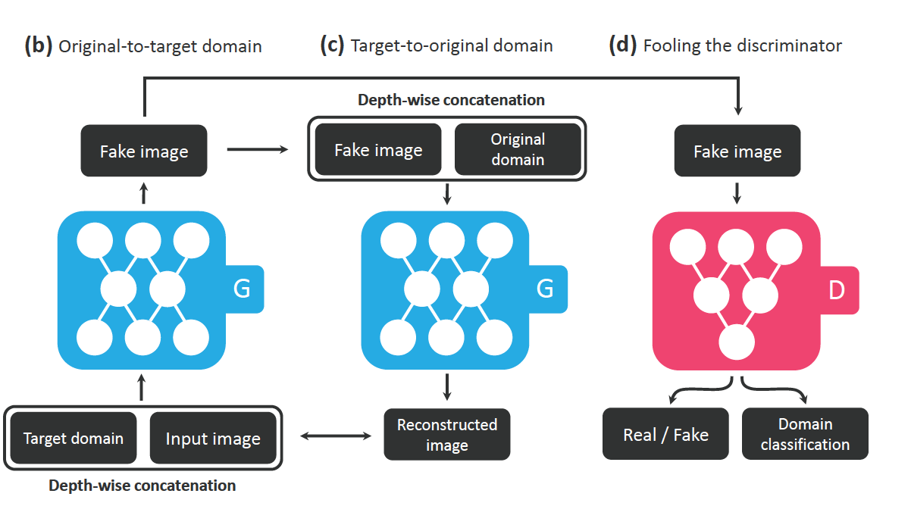

# StarGAN

~~저자가 한국인... 고려대 석사생(학부 12학번)과 클로바 인턴? 대단하다. 존경스러움. 특히 1저자는 pytorch tutorial 레포도 엄청나다. 나도 저렇게 될 수 있을까? [존경스러운 인물](https://yunjey.github.io/)~~

**a novel and scalable approach that can perform image-to-image translations for multiple domains using only a single model. StarGAN is capable of learning mappings among multiple domains using a single generator**



1. G takes in as input both the image and target domain label and generates an fake image. (b)
2. G tries to reconstruct the original image from the fake image given the original domain label.
3. Here, Discriminator not only tells us the fakeness but also classifies an image to its corresponding domain, so that G tries to generate images that are indistinguishable from real images and are classifiable as target domain by D. i.e. G will ultimately learn to generate realistic images corresponding to the given target domain. (d)

## Loss

- Adversarial Loss
- Domain Classification Loss (Target Domain으로 Classify 되었는지. Conditional? Cross Entropy)
```python
def criterion_cls(logit, target):
    return F.binary_cross_entropy_with_logits(logit, target, size_average=False) / logit.size(0)
```
- Reconstruction Loss (Cycle Consistence. fake image에 original domain을 넣어줘서 생성된 결과와 original image를 비교. L1)

## Generator

Resnet 기반의 Generator.

Adapted from CycleGAN [33], StarGAN has the generator network composed of two convolutional layers with the stride size of two for downsampling, six residual blocks [5], and two transposed convolutional layers with the stride size of two for upsampling. We
use instance normalization [29] for the generator but no normalization for the discriminator. We leverage PatchGANs [7, 15, 33] for the discriminator network, which classifies whether local image patches are real or fake.

## Discriminator

patchGAN과 더불어 class(domain) classification

```python
class Discriminator(nn.Module):
    def __init__(self, img_shape=(3, 128, 128), c_dim=5, n_strided=6):
        super(Discriminator, self).__init__()
        channels, img_size, _ = img_shape

        def discriminator_block(in_filters, out_filters):
            """Returns downsampling layers of each discriminator block"""
            layers = [nn.Conv2d(in_filters, out_filters, 4, stride=2, padding=1), nn.LeakyReLU(0.01)]
            return layers

        layers = discriminator_block(channels, 64)
        curr_dim = 64
        for _ in range(n_strided - 1):
            layers.extend(discriminator_block(curr_dim, curr_dim * 2))
            curr_dim *= 2

        self.model = nn.Sequential(*layers)

        # Output 1: PatchGAN
        self.out1 = nn.Conv2d(curr_dim, 1, 3, padding=1, bias=False)
        # Output 2: Class prediction
        kernel_size = img_size // 2 ** n_strided
        self.out2 = nn.Conv2d(curr_dim, c_dim, kernel_size, bias=False)

    def forward(self, img):
        feature_repr = self.model(img)
        out_adv = self.out1(feature_repr)
        out_cls = self.out2(feature_repr)
        return out_adv, out_cls.view(out_cls.size(0), -1)
```

## Training

#### Improved GAN Training. 

To stabilize the training process and generate higher quality images, we replace Eq. (1) `adversarial loss` with Wasserstein GAN objective with gradient penalty.


```python
def compute_gradient_penalty(D, real_samples, fake_samples):
    """Calculates the gradient penalty loss for WGAN GP"""
    # Random weight term for interpolation between real and fake samples
    alpha = Tensor(np.random.random((real_samples.size(0), 1, 1, 1)))
    # Get random interpolation between real and fake samples
    interpolates = (alpha * real_samples + ((1 - alpha) * fake_samples)).requires_grad_(True)
    d_interpolates, _ = D(interpolates)
    fake = Variable(Tensor(np.ones(d_interpolates.shape)), requires_grad=False)
    # Get gradient w.r.t. interpolates
    gradients = autograd.grad(
        outputs=d_interpolates,
        inputs=interpolates,
        grad_outputs=fake,
        create_graph=True,
        retain_graph=True,
        only_inputs=True,
    )[0]
    gradients = gradients.view(gradients.size(0), -1)
    gradient_penalty = ((gradients.norm(2, dim=1) - 1) ** 2).mean()
    return gradient_penalty

```

### Train Discriminator

- `img` :: original image
- `labels` :: real labels of original image

```python
# ---------------------
#  Train Discriminator
# ---------------------

optimizer_D.zero_grad()

# Real images
real_validity, pred_cls = discriminator(imgs)
# Fake images
fake_validity, _ = discriminator(fake_imgs.detach())
# Gradient penalty
gradient_penalty = compute_gradient_penalty(discriminator, imgs.data, fake_imgs.data)
# Adversarial loss
loss_D_adv = -torch.mean(real_validity) + torch.mean(fake_validity) + lambda_gp * gradient_penalty
# Classification loss
loss_D_cls = criterion_cls(pred_cls, labels)
# Total loss
loss_D = loss_D_adv + lambda_cls * loss_D_cls

loss_D.backward()
optimizer_D.step()

optimizer_G.zero_grad()
```

### Train Generator

Perform one generator update after five discriminator updates as in `Improved training of wasserstein gans. arXiv preprint arXiv:1704.00028, 2017.`

```python
    # Every n_critic times update generator
    if i % opt.n_critic == 0:

        # -----------------
        #  Train Generator
        # -----------------

        # Translate and reconstruct image
        gen_imgs = generator(imgs, sampled_c)
        recov_imgs = generator(gen_imgs, labels)
        # Discriminator evaluates translated image
        fake_validity, pred_cls = discriminator(gen_imgs)
        # Adversarial loss
        loss_G_adv = -torch.mean(fake_validity)
        # Classification loss
        loss_G_cls = criterion_cls(pred_cls, sampled_c)
        # Reconstruction loss
        loss_G_rec = criterion_cycle(recov_imgs, imgs)
        # Total loss
        loss_G = loss_G_adv + lambda_cls * loss_G_cls + lambda_rec * loss_G_rec

        loss_G.backward()
        optimizer_G.step()
```