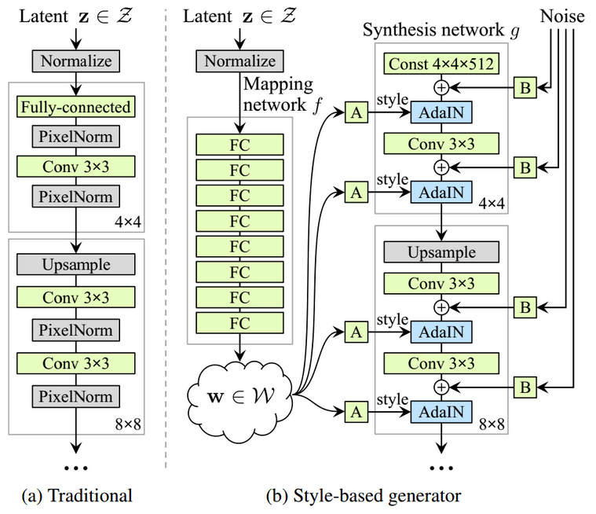

# StyleGAN: A Style-Based Generator Architecture for GANs by NVIDIA

[link](https://arxiv.org/pdf/1812.04948.pdf)

## Adaptive Instance Normalization (AdaIN)

[관련 논문](https://arxiv.org/abs/1703.06868)

The idea of style transfer of another image starts to become natural. What if γ, β is injected from the feature statistics of another image? In this way, we will be able to model any arbitrary style by just giving our desired feature image mean as β and variance as γ. AdaIN does exactly that: it receives an input x(content) and a style input y, and simply aligns the channel-wise mean and variance of x to match those of y. Mathematically:

## Mapping Network

The intermediate latent space W does not have to support sampling according to any fixed distribution. This mapping f “unwraps” the space of W, so it implicitly enforces a sort of disentangled representation. This means that the factors of variation become more linear.

고정된 input distribution (예: Gaussion)에 학습 이미지의 distribution (a)을 맞춰야 한다는 한계가 있습니다. 이로 인해 visual attribute가 input space에 non-linear하게 mapping되고 (b), input vector로 visual attribute를 조절하기가 매우 어려워집니다. 예를 들어, 학습 이미지에 검은 머리의 사람이 대부분일 경우 input space의 대부분의 영역이 검은 머리를 표현하게되고, input vector를 조절하여 머리 색을 변경하기가 어려워집니다. 그러나 mapping network를 사용할 경우 w는 고정된 distribution을 따를 필요가 없어지기 때문에, 학습 데이터를 훨씬 유동적인 공간 (intermediate latent space)에 mapping할 수 있고  w를 이용하여 visual attribute를 조절하기가 훨씬 용이해집니다.

## Synthesis network g

AdaIN layer가 style transfer를 담당함.

Each layer starts with an upsampling layer to double spatial resolution. Then, a convolution block is added. After each convolution, a 2D per-pixel noise is added to model stochasticity. Finally, with the magic `AdaIN layer`, the learned intermediate latent space that corresponds to style is injected.

## Stochastic Variation

In a conventional generator, the latent vector z is fed in the input of the network. This is considered sub-optimal as it consumes the generator’s learning capacity.

By adding per-pixel noise after `each convolution`, it is experimentally validated that the effect of noise appears localized in the network.

각 layer마다 noise를 추가하여 stochastic한 variation을 준다 (머리카락, 주름 등. 필연적으로 stochastic한 분포가 존재한다.) Latent vector가 더 prime한 distribution에 집중할 수 있도록.

## Style Mixing

각 Layer끼리 담당하는 style이 correlated 되지 않도록. (한 latent vector w를 모든 layer에서 사용하므로.)

To further encourage the styles to localize, we employ mixing regularization, where a given percentage of images are generated using two random latent codes instead of one
during training.

~~코드?~~

## Analyzing and Improving the Image Quality of StyleGAN [StyleGANv2]