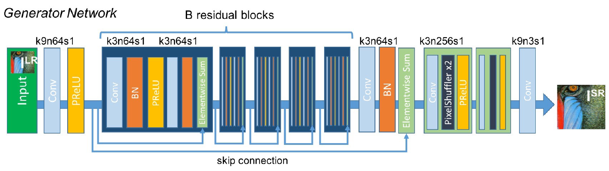
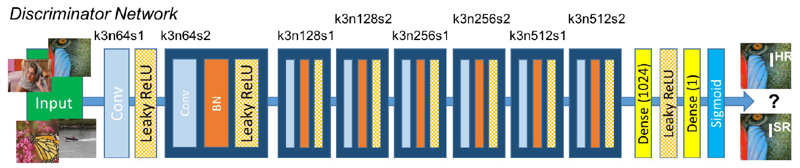
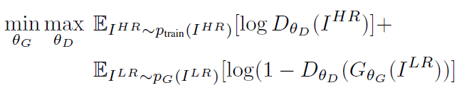
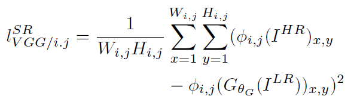

# Super-Resolution GAN

Photo-Realistic Single Image Super-Resolution Using a Generative Adversarial Network.

- generative adversarial network (GAN) for image super-resolution (SR), `SRGAN`, by Twitter
- The network wihout using GAN is `SRResNet`.

we propose a super-resolution generative adversarial network (SRGAN) for which we employ a deep residual network (ResNet) with skip-connection and diverge from MSE as the sole optimization target.


## Architecture




Architecture of Generator and Discriminator Network with corresponding kernel size (k), number of feature maps (n) and stride (s) indicated for each convolutional layer.


## Loss



### Perceptual Loss

- Content Loss (단순한 MSE Loss가 아닌 `VGG Loss`)

**The content loss is motivated by perceptual similarity instead of similarity in pixel space.**



The discriminator network contains eight convolutional layers with an increasing number of 3×3 filter kernels, increasing by a factor of 2 from 64 to 512 kernels as in the VGG network.

단순히 픽셀 값의 유사함이 아닌 perceptual similarity. 이를 위해 VGG-NET의 feature map에서의 유사도를 따진다.

With φi,j we indicate the feature map obtained by the j-th convolution (after activation) before the i-th maxpooling layer within the VGG19 network, which we consider given. We then define the VGG loss as the euclidean distance between the feature representations of a reconstructed image GθG (I_LR) and the reference image I_ HR

- Adversarial Loss

## Training

- feature extractor : `vgg19`
- generated image의 pixel value를 비교하는 것이 아닌, vggnet의 feature를 비교.
- better feature representation을 위해 vggnet이 학습될 것임.
- feature 간에는 `L1 Loss` 사용

```python

for epoch in range(opt.epoch, opt.n_epochs):
    for i, imgs in enumerate(dataloader):

        # Configure model input
        imgs_lr = Variable(imgs["lr"].type(Tensor))
        imgs_hr = Variable(imgs["hr"].type(Tensor))

        # Adversarial ground truths
        valid = Variable(Tensor(np.ones((imgs_lr.size(0), *discriminator.output_shape))), requires_grad=False)
        fake = Variable(Tensor(np.zeros((imgs_lr.size(0), *discriminator.output_shape))), requires_grad=False)

        # ------------------
        #  Train Generators
        # ------------------

        optimizer_G.zero_grad()

        # Generate a high resolution image from low resolution input
        gen_hr = generator(imgs_lr)

        # Adversarial loss (MSE Loss -> Patch 기반..)
        loss_GAN = criterion_GAN(discriminator(gen_hr), valid)

        # Content loss
        gen_features = feature_extractor(gen_hr)
        real_features = feature_extractor(imgs_hr)
        loss_content = criterion_content(gen_features, real_features.detach())

        # Total loss
        loss_G = loss_content + 1e-3 * loss_GAN

        loss_G.backward()
        optimizer_G.step()

        # ---------------------
        #  Train Discriminator
        # ---------------------

        optimizer_D.zero_grad()

        # Loss of real and fake images
        loss_real = criterion_GAN(discriminator(imgs_hr), valid)
        loss_fake = criterion_GAN(discriminator(gen_hr.detach()), fake)

        # Total loss
        loss_D = (loss_real + loss_fake) / 2

        loss_D.backward()
        optimizer_D.step()

```